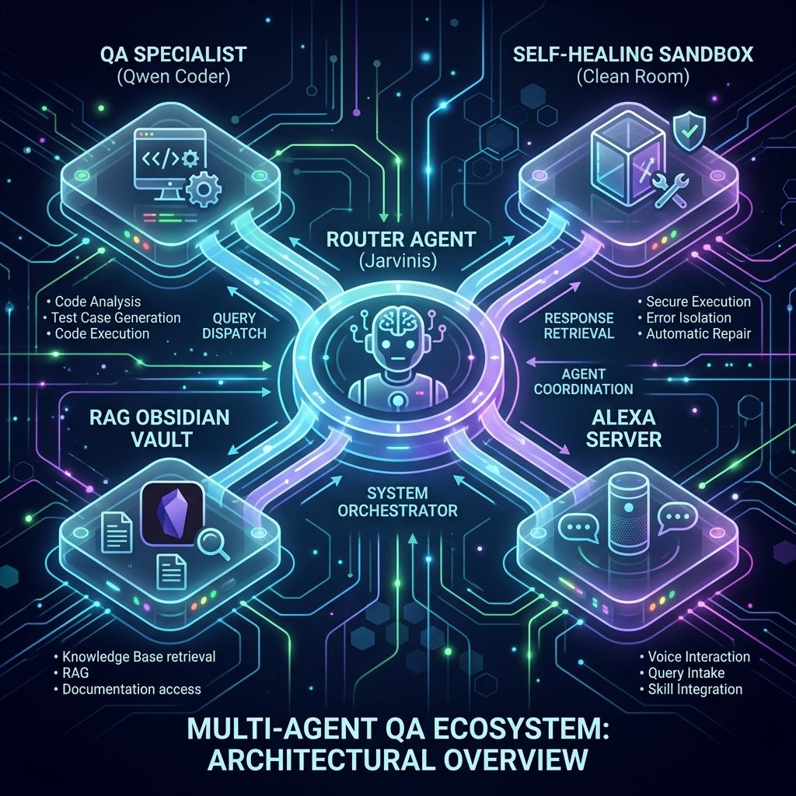
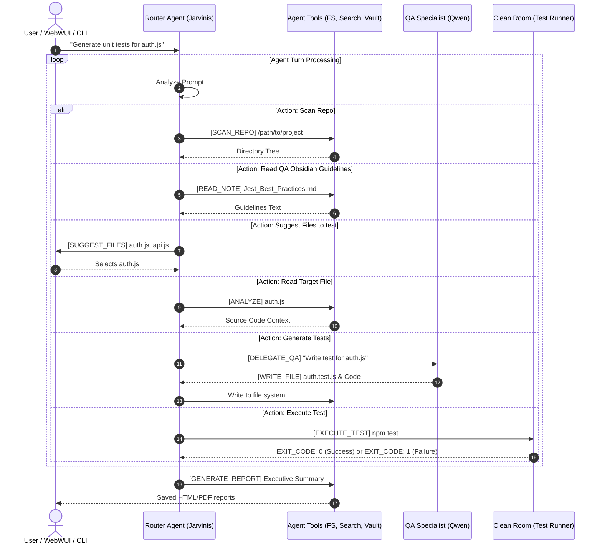

# JARVINIS QA Agent - System Architecture

Welcome to the technical architecture documentation of the **JARVINIS QA Agent**. This document details the layout, execution cycles, state machine, and communication protocols of this multi-agent system. It is designed to be easily read and understood by both human developers and AI agents joining this project.

---

## 🗺️ Architectural Overview

JARVINIS is an orchestrator-centric multi-agent QA ecosystem powered by local LLMs (via Ollama) and structured tools. It automates repository scanning, test planning, script generation, execution, self-healing, and executive report compiling.



---

## 📁 Repository Structure

```text
antigravity-qa-agent/
├── .env                  # Environment configuration (ports, Ollama models, paths)
├── Modelfile             # Ollama system definition for the main Router Agent (jarvinis)
├── package.json          # Dependency manifest and start scripts
├── index.js              # Roteador: chat (padrão) ou qa
├── chat.js               # Frente 1 — Chat local + sessão headless
├── qa-agent.js           # Frente 2 — Agente QA (state machine por tags)
├── lib/                  # config, ollama, vault, session, cli-args
├── agent-tools.js        # File system, test runner, and Wikipedia Search integration
├── reporter.js           # PDF and HTML report generator using custom styling
├── alexa-server.js       # Alexa Skill Voice Webhook server (express)
├── docs/
│   └── images/
│       └── architecture_diagram.png
└── tests/                # Unit tests for the agent tools and reporter
    ├── agent-tools.test.js
    └── reporter.test.js
```

---

## ⚙️ Core Components & Roles

| Component | Primary Role | Underlying Model / Technology | Key Files |
| :--- | :--- | :--- | :--- |
| **Router Agent (Jarvinis)** | System Orchestrator. Keeps chat history, processes intents, calls files, and coordinates specialists. | `deepseek-r1:14b` (via `.env`) | `index.js`, `Modelfile` |
| **QA Specialist Agent** | Test Code Generator. Focuses purely on writing Vitest/Jest/Playwright code. | `qwen2.5-coder:14b` (via `.env`) | `index.js` (Tag: `[DELEGATE_QA]`) |
| **Self-Healing Agent** | Test Fixer. Operates in an isolated Clean Room sandbox to debug failing tests. | `qwen2.5-coder:14b` / Router | `index.js` (Tag: `[EXECUTE_TEST]`) |
| **RAG Obsidian Vault** | Long-term memory and QA patterns database. | Markdown files / Directory scanning | `scratch.js`, `index.js` (Tag: `[READ_NOTE]`) |
| **Reporter Service** | Compiles stdout logs and AI summaries into polished HTML and PDF files. | Node.js / `html-pdf-node` | `reporter.js` |
| **Alexa Voice Bridge** | Listens to Alexa skills, invokes the local LLM model, and handles response timeouts. | Express / Node.js | `alexa-server.js` |

---

## 🔄 The Tag-Based Execution Loop (State Machine)

The orchestrator (`index.js`) processes the user prompt inside an asynchronous loop (`processAgentTurn`). Instead of outputting free text, the LLM emits **Action Tags** which are intercepted by regex parsers in Node.js to trigger local system commands.



### 🏷️ Supported Action Tags (Regex Specifications)

Other agents must emit tags matching the following formats exactly:

#### 1. Directory Scanning
* **Tag:** `[SCAN_REPO] <absolute_or_relative_path>`
* **Regex:** `/^\[SCAN_REPO\][ \t]+([^\r\n]+)/m`
* **Effect:** Triggers repository scanning, returning the directory hierarchy.

#### 2. File Recommendation
* **Tag:** `[SUGGEST_FILES] file1, file2, file3`
* **Regex:** `/^\[SUGGEST_FILES\]\s*(.+)/m`
* **Effect:** Prompts the user to select which recommended files to target.

#### 3. File Context Read
* **Tag:** `[ANALYZE] <file_path>`
* **Regex:** `/^\[ANALYZE\][ \t]+([^\r\n]+)/m`
* **Effect:** Reads the content of the target file relative to the project path.

#### 4. Obsidian Knowledge RAG
* **Tag:** `[READ_NOTE] <note_name.md>`
* **Regex:** `/^\[READ_NOTE\][ \t]+([^\r\n]+)/m`
* **Effect:** Reads the markdown file from the user's Obsidian Vault path configured in `.env`.

#### 5. Code Generation Delegation
* **Tag:** `[DELEGATE_QA] <instructions>`
* **Regex:** `/^\[DELEGATE_QA\][ \t]+([^\r\n]+)/m`
* **Effect:** Switches to the Specialist QA Coder to generate tests. The QA Coder responds using:
  `[WRITE_FILE] <filename>\n<code>`

#### 6. Writing to Disk
* **Tag:** `[WRITE_FILE] <filename>\n<code>`
* **Regex:** `/^\[WRITE_FILE\][ \t]+([^\r\n]+)\r?\n([\s\S]+)/m`
* **Effect:** Writes the code blocks into `qa_sandbox` on the local disk.

#### 7. Test Running
* **Tag:** `[EXECUTE_TEST] <command>`
* **Regex:** `/^\[EXECUTE_TEST\][ \t]+([^\r\n]+)/m`
* **Effect:** Executes the tests inside `qa_sandbox`. Returns stdout, stderr, and the command exit code.

#### 8. Report Generation
* **Tag:** `[GENERATE_REPORT] <executive_summary>`
* **Regex:** `/^\[GENERATE_REPORT\]\s*([\s\S]+)/m`
* **Effect:** Compiles the tests execution log and the AI summary into HTML/PDF reports.

#### 9. Wikipedia Web RAG
* **Tag:** `[SEARCH] <query>`
* **Regex:** `/^\[SEARCH\][ \t]+([^\r\n]+)/m`
* **Effect:** Performs a DuckDuckGo/Google search and appends the learnings to both the conversation context and the Obsidian vault under `Learned_Topics/`.

---

## 🛠️ Double Execution Modes: Interactive vs. Headless

JARVINIS supports two execution modes determined dynamically by command-line arguments:

1. **Interactive CLI Mode (Standard)**
   * **Trigger:** Run `npm run start:qa` (or `node qa-agent.js`).
   * **Behavior:** Uses `@inquirer/prompts` to ask questions (like file selection and test types), clears the console with visual graphics, and displays real-time `ora` spinner load indicators.
2. **Headless/API Mode (Programmatic)**
   * **Trigger:** Run `node chat.js --session ID "message"` or `node qa-agent.js --json --session ID "message"` (see `docs/OPEN_WEBUI.md`).
   * **Behavior:** Skips all inquirer selections and visual decorators. If it reaches a human-in-the-loop state (like `[SUGGEST_FILES]` or `[PLAN_READY]`) or finishes the turn, it outputs the raw response to `stdout` and exits immediately with `exit(0)`. This allows seamless integrations with third-party web tools (e.g., Open WebUI, desktop wrappers, or external scripts) without hanging the backend process.

---

## 📦 qa_sandbox Bootstrap (`lib/sandbox-bootstrap.js`)

Ao escanear um projeto ou gravar testes, o sistema:

1. Detecta **Jest / Vitest / Playwright** no `package.json` do repositório alvo.
2. Gera `qa_sandbox/package.json`, config do runner e `.jarvinis-manifest.json`.
3. Executa `npm install` antes do primeiro `[EXECUTE_TEST]` (configurável via `.env`).
4. Informa ao LLM o comando sugerido (`npm test`).

---

## 🩹 Self-Healing Sandbox ("Clean Room" Isolation)

If a test execution fails (exit code is not 0), the system implements a **Self-Healing Loop**:

1. **Swapping Memory:** The orchestrator temporarily backups the main conversation history (`chatHistory`).
2. **Entering the Clean Room:** It replaces the conversation array with an isolated system instruction directing the LLM to act *only* as a test repair specialist.
3. **Healing Cycle:** The specialist is fed the raw test error logs. It must analyze the problem, write the corrected test file using `[WRITE_FILE]`, and re-execute `[EXECUTE_TEST]`.
4. **Restoring Memory:** 
   * If the tests pass within **3 retries**, the system exits the Clean Room, restores the original conversation history, and notifies the orchestrator of the fix.
   * If it fails after 3 attempts, it restores the original history and proceeds to output a failed test report.

---

## 🎙️ Alexa Server Voice Integration (`alexa-server.js`)

An Express server running on port `3001` serves as a webhook endpoint (`/alexa`) connecting to Alexa skills via an Ngrok tunnel:

* **Intent Interception:** Translates spoken Alexa intents to prompts for the local Ollama model.
* **Timeout Protection:** Alexa requires webhook responses within **8 seconds**. The server wraps the Ollama generation logic in an `AbortController`. If Ollama does not finish generating within 8 seconds, the server aborts the request and responds with a friendly voice error message, preventing timeouts on the Amazon Alexa service.
