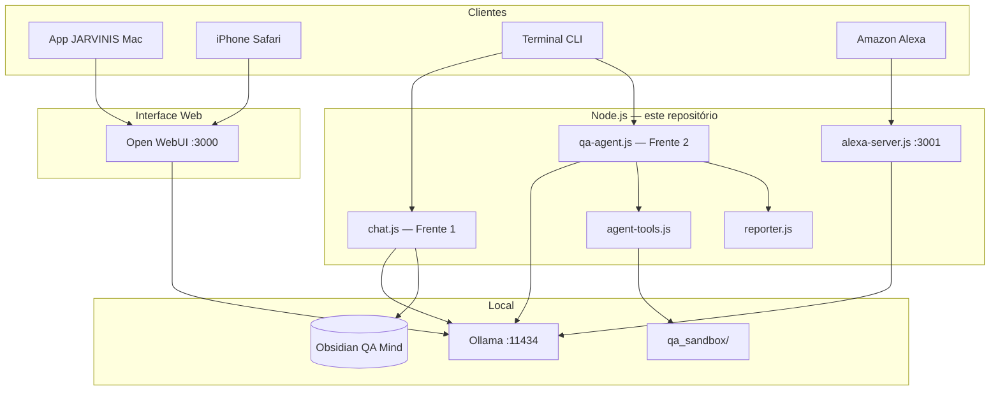

# JARVINIS — antigravity-qa-agent

Assistente de IA **100% local** (via [Ollama](https://ollama.com)), criado por Vini Leme. Roda no seu Mac sem pagar tokens de API na nuvem. Combina **chat inteligente**, **automação de QA** em repositórios e **integração por voz** (Alexa), com memória em notas Obsidian e interface web para iPhone.

---

## Índice

1. [O que é](#o-que-é)
2. [Arquitetura](#arquitetura)
3. [Como funciona](#como-funciona)
4. [Pré-requisitos](#pré-requisitos)
5. [Instalação (primeira vez)](#instalação-primeira-vez)
6. [Passo a passo por ferramenta](#passo-a-passo-por-ferramenta)
7. [Configuração (.env)](#configuração-env)
8. [Estrutura do repositório](#estrutura-do-repositório)
9. [Testes e desenvolvimento](#testes-e-desenvolvimento)
10. [Solução de problemas](#solução-de-problemas)
11. [Documentação adicional](#documentação-adicional)

---

## O que é

O **JARVINIS** não é um único chatbot: são **três capacidades** que compartilham Ollama e o cofre Obsidian **QA Mind**, mas com entrypoints separados:

| Frente | O que faz | Para quem |
|--------|-----------|-----------|
| **Chat** | Conversa geral, explicações técnicas, RAG das suas notas, busca na Wikipedia quando não sabe | Uso diário no PC, iPhone ou app JARVINIS |
| **Agente QA** | Escaneia um repo, planeja testes, gera código (Jest/Vitest/Playwright), executa na sandbox, conserta falhas e gera relatório PDF/HTML | Automação de qualidade em projetos |
| **Alexa** | Respostas curtas por voz na Echo Dot | Mãos livres, mesma persona `jarvinis` |

A **interface visual** (app JARVINIS no Mac, Safari no iPhone) usa **Open WebUI** na porta **3000**. Os scripts Node (`chat.js`, `qa-agent.js`) são o “cérebro” customizado; o Open WebUI é a “cara” no navegador.

**Privacidade:** inferência local (Ollama). Apenas a tag `[SEARCH]` do chat consulta a Wikipedia (opcional, com internet).

---

## Arquitetura

### Visão geral



Diagrama detalhado do agente QA: [docs/images/architecture_diagram.png](docs/images/architecture_diagram.png) · Documentação técnica: [ARCHITECTURE.md](ARCHITECTURE.md)

### Padrão arquitetural

- **Chat:** orquestração simples — prompt → Ollama → resposta (com loop `[SEARCH]` se necessário).
- **QA:** **máquina de estados orientada a tags** — o LLM emite tags (`[SCAN_REPO]`, `[DELEGATE_QA]`, etc.) e o Node.js executa ferramentas reais (arquivos, testes, relatórios).
- **Sem Clean Architecture / MVC:** módulos flat (`chat.js`, `qa-agent.js`, `lib/*`) por simplicidade e iteração rápida.

### Modelos Ollama (padrão)

| Papel | Variável `.env` | Modelo sugerido |
|-------|-----------------|-----------------|
| Chat / voz / historiador | `OLLAMA_MODEL` | `jarvinis` (ver `Modelfile`) |
| Roteador QA | `OLLAMA_ROUTER_MODEL` | `deepseek-r1:14b` |
| Gerador de testes | `OLLAMA_QA_MODEL` | `qwen2.5-coder:14b` |

---

## Como funciona

### Frente 1 — Chat (`chat.js`)

1. Carrega o **conteúdo completo** das notas do Obsidian no system prompt.
2. Envia a conversa para Ollama (`/api/chat`) com o modelo `jarvinis`.
3. Se o modelo responder com `[SEARCH] termo`, busca na Wikipedia, aprende e grava em `Learned_Topics/`.
4. Em modo **sessão** (`--session ID`), persiste o histórico em `.jarvinis/sessions/` para multi-turno (Open WebUI / iPhone).

### Frente 2 — Agente QA (`qa-agent.js`)

1. Você informa o **caminho de um repositório**.
2. O sistema **escaneia** arquivos, **prepara a `qa_sandbox`** (Jest/Vitest/Playwright detectado automaticamente).
3. O **roteador** (DeepSeek-R1) planeja e emite tags; o **especialista** (Qwen) escreve código de teste.
4. Testes rodam em `projeto/qa_sandbox/`; se falharem, **self-healing** (até 3 tentativas em contexto isolado).
5. Ao final, `[GENERATE_REPORT]` gera **HTML + PDF** em `qa_sandbox/reports/`.

Tags principais: `[SCAN_REPO]`, `[SUGGEST_FILES]`, `[ANALYZE]`, `[READ_NOTE]`, `[PLAN_READY]`, `[DELEGATE_QA]`, `[WRITE_FILE]`, `[EXECUTE_TEST]`, `[GENERATE_REPORT]`.

### Open WebUI + app JARVINIS (porta 3000)

- Container Docker (`docker-compose.yml`) expõe a UI em **http://localhost:3000**.
- O app JARVINIS no Mac é um cliente dessa URL.
- No iPhone: **http://&lt;IP-do-Mac&gt;:3000** na mesma Wi‑Fi.
- O Open WebUI fala direto com o Ollama; opcionalmente você pode conectar **pipes** que chamam `chat.js` (persona + Obsidian customizados).

### Alexa (`alexa-server.js`)

- Webhook Express na porta **3001**.
- Requer **Ngrok** para a Amazon alcançar seu Mac.
- Usa `ollama generate` com modelo `jarvinis`, respostas curtas (limite ~8s da Alexa).

---

## Pré-requisitos

| Software | Para quê |
|----------|----------|
| **macOS** (desenvolvido/testado no Mac) | Ambiente principal |
| **Node.js 20+** | Scripts do projeto |
| **Ollama** | LLMs locais |
| **Docker Desktop** | Open WebUI (app + iPhone) |
| **Obsidian vault** (opcional) | RAG — pasta QA Mind |
| **Ngrok** (opcional) | Apenas Alexa |

Modelos mínimos:

```bash
ollama create jarvinis -f Modelfile
ollama pull deepseek-r1:14b    # QA (opcional mas recomendado)
ollama pull qwen2.5-coder:14b  # geração de testes
```

---

## Instalação (primeira vez)

```bash
cd /caminho/antigravity-qa-agent

# Setup automático: .env, npm install, JARVINIS_ROOT
./scripts/setup.sh

# Edite o .env se necessário (vault, caminhos)
cp .env.example .env   # só se setup não criou

# Valide Ollama + modelos
npm run check:env
```

**Shell (recomendado)** — adicione ao `~/.zshrc` (o setup já pode ter feito):

```bash
export JARVINIS_ROOT="/caminho/absoluto/antigravity-qa-agent"
export PATH="$JARVINIS_ROOT/bin:$PATH"

jarvinis() { "$JARVINIS_ROOT/scripts/jarvinis.sh" "$@"; }
alias jarvinis-on='jarvinis bg'
```

Depois: `source ~/.zshrc`

---

## Passo a passo por ferramenta

### 1. Open WebUI + app JARVINIS + iPhone (uso principal)

É o modo **“deixar rodando em background”** para usar a interface gráfica.

**Subir serviços:**

```bash
source ~/.zshrc
jarvinis bg
# ou: npm run start:bg
```

Você deve ver:

- `http://localhost:3000` — Mac / app JARVINIS  
- `http://192.168.x.x:3000` — iPhone (mesma Wi‑Fi)

**No app JARVINIS (Mac):** clique em **Reload JARVINIS**.

**No iPhone:** Safari → URL do IP → **Adicionar à Tela de Início**.

**No Open WebUI:** selecione o modelo **jarvinis** (ou outro instalado).

**Parar:**

```bash
jarvinis stop
# ou: npm run stop:bg
```

**Autostart no login do Mac (opcional):**

```bash
./scripts/install-autostart.sh
```

Mais detalhes: [docs/IPHONE.md](docs/IPHONE.md)

---

### 2. Chat no terminal (Frente 1)

**Modo conversa interativa:**

```bash
jarvinis chat
# ou: npm run start:chat
```

**Uma pergunta só:**

```bash
chat "Explique o padrão Arrange-Act-Assert"
```

**Multi-turno (mesma sessão):**

```bash
node chat.js --session minha-sessao "Primeira pergunta"
node chat.js --session minha-sessao "Continuação do assunto"
```

**Reiniciar sessão:**

```bash
node chat.js --session minha-sessao --reset
```

**JSON (integrações):**

```bash
node chat.js --json --session webui "Sua pergunta"
# Saída: {"response":"...","session":"webui"}
```

---

### 3. Agente QA (Frente 2)

**Modo guiado (terminal):**

```bash
jarvinis qa
# ou: npm run start:qa
```

1. Cole o **caminho absoluto** do projeto (ex.: `/Users/vini/projeto`).
2. Responda às perguntas (documentação, arquivo alvo, tipos de teste).
3. Aprove o plano quando aparecer `[PLAN_READY]`.
4. Aguarde geração, execução e relatório em `qa_sandbox/reports/`.

**Modo autônomo (menos prompts):**

```bash
node qa-agent.js --autonomous "/caminho/do/projeto"
```

**Com sessão (várias mensagens / headless):**

```bash
node qa-agent.js --json --session qa1 --autonomous "/caminho/repo"
node qa-agent.js --json --session qa1 "sim"   # aprovar plano, etc.
```

**Sandbox:** criada automaticamente em `seu-projeto/qa_sandbox/` com Jest/Vitest/Playwright detectado do `package.json` do alvo. Testes devem importar código assim:

```javascript
import { minhaFuncao } from "../src/minhaFuncao.js";
```

---

### 4. Open WebUI com pipe JARVINIS (opcional)

Use se quiser que o Open WebUI chame o **chat.js** (Obsidian + regras JarVinis) em vez do chat nativo.

**Comando para colar no Admin → Functions:**

```bash
bash /caminho/antigravity-qa-agent/config/open-webui/jarvinis-chat.pipe.sh
```

Variáveis que o Open WebUI deve passar: `user_id`, `prompt`.

**One-liner alternativo:**

```bash
node /caminho/antigravity-qa-agent/chat.js --json --session "{{user_id}}" "{{prompt}}"
```

Referência: [config/open-webui/OPEN_WEBUI_COPIAR_COLAR.txt](config/open-webui/OPEN_WEBUI_COPIAR_COLAR.txt)

---

### 5. Alexa (voz)

**Pré-requisito:** Ollama rodando; modelo `jarvinis` criado.

**Terminal 1 — servidor:**

```bash
jarvinis alexa
# ou: npm run start:alexa
# Porta 3001
```

**Terminal 2 — túnel:**

```bash
ngrok http 3001
```

Copie a URL `https://...` do Ngrok.

**Alexa Developer Console:**

1. [developer.amazon.com/alexa/console/ask](https://developer.amazon.com/alexa/console/ask)
2. Skill JARVINIS → **Build** → **Endpoint**
3. Cole a URL Ngrok em **Default Region**
4. SSL: *"My development endpoint is a sub-domain..."*
5. **Save Endpoints** → **Build Skill**

**Usar:** *"Alexa, abra o Jarvinis"* + sua pergunta.

**Problemas comuns:**

| Sintoma | Solução |
|---------|---------|
| Timeout | Pergunta mais curta; modelo demora >8s |
| Porta 3001 em uso | `lsof -i :3001` e encerre o processo |
| Personalidade | Edite `Modelfile` → `ollama create jarvinis -f Modelfile` |

---

### 6. Comandos utilitários

| Comando | Descrição |
|---------|-----------|
| `jarvinis check` | Valida `.env`, Ollama e modelos |
| `jarvinis setup` | Reexecuta setup |
| `jarvinis test` | Testes unitários do projeto |
| `npm run check:env` | Igual `jarvinis check` |
| `node index.js` | Roteador (chat por padrão) |
| `node index.js qa` | Atalho para agente QA |

---

## Configuração (.env)

Copie `.env.example` para `.env`. Principais variáveis:

```env
# Ollama
OLLAMA_HOST=http://localhost:11434
OLLAMA_MODEL=jarvinis
OLLAMA_ROUTER_MODEL=deepseek-r1:14b
OLLAMA_QA_MODEL=qwen2.5-coder:14b
OLLAMA_HISTORY_MODEL=jarvinis

# Obsidian (use aspas se o caminho tiver espaços)
OBSIDIAN_VAULT_PATH="/Users/vini/Documents/Repo/Personal/QA Mind"

# Caminhos do projeto
JARVINIS_ROOT=/caminho/absoluto/antigravity-qa-agent
JARVINIS_SESSION_DIR=/caminho/absoluto/antigravity-qa-agent/.jarvinis/sessions

# Sandbox QA
QA_SANDBOX_AUTO_BOOTSTRAP=true
QA_SANDBOX_AUTO_INSTALL=true
QA_SANDBOX_DEFAULT_RUNNER=jest

# Alexa
PORT=3001
```

Validar: `npm run check:env`

---

## Estrutura do repositório

```text
antigravity-qa-agent/
├── chat.js                 # Frente 1 — Chat
├── qa-agent.js             # Frente 2 — Agente QA
├── alexa-server.js         # Alexa webhook
├── index.js                # Roteador CLI
├── agent-tools.js          # Scan, leitura, sandbox, exec testes
├── reporter.js             # Relatórios PDF/HTML
├── Modelfile               # Persona jarvinis no Ollama
├── docker-compose.yml      # Open WebUI :3000
├── bin/                    # Atalhos no PATH (chat, qa, jarvinis)
├── lib/
│   ├── config.js           # .env e helpers
│   ├── ollama.js           # Chamadas Ollama + strip thinking
│   ├── vault.js            # Obsidian RAG
│   ├── session.js          # Sessões multi-turno
│   ├── sandbox-bootstrap.js# Prepara qa_sandbox
│   └── ...
├── scripts/
│   ├── start-background.sh # Ollama + Open WebUI
│   ├── stop-background.sh
│   ├── setup.sh
│   └── check-env.js
├── config/open-webui/      # Pipes para Open WebUI
├── tests/                  # Jest (agent-tools, reporter, sandbox)
└── docs/                   # Guias complementares
```

---

## Testes e desenvolvimento

```bash
npm test
```

Cobre `agent-tools`, `reporter` e `sandbox-bootstrap`. O orquestrador QA (`qa-agent.js`) não tem testes E2E automatizados ainda.

---

## Solução de problemas

| Problema | Causa provável | O que fazer |
|----------|----------------|-------------|
| App JARVINIS “Can't connect to localhost:3000” | Open WebUI parado | `jarvinis bg` e Reload |
| `jarvinis: command not found` | Shell sem config | `source ~/.zshrc` |
| `Cannot find module '/chat.js'` | `$JARVINIS_ROOT` vazio | Use caminho completo ou `source ~/.zshrc` |
| Ollama offline | App fechado | Abra Ollama; `jarvinis check` |
| Docker não sobe | Docker Desktop fechado | Abra Docker; rode `jarvinis bg` de novo |
| QA falha em `npm test` | Sandbox sem deps | Veja `qa_sandbox/README.md`; `QA_SANDBOX_AUTO_INSTALL=true` |
| Modelo não encontrado | Pull pendente | `ollama pull <modelo>` |

---

## Documentação adicional

| Arquivo | Conteúdo |
|---------|----------|
| [ARCHITECTURE.md](ARCHITECTURE.md) | Tags, state machine, Clean Room, diagramas |
| [docs/SETUP.md](docs/SETUP.md) | Setup expandido |
| [docs/IPHONE.md](docs/IPHONE.md) | iPhone e autostart |
| [docs/OPEN_WEBUI.md](docs/OPEN_WEBUI.md) | Pipes e integração WebUI |
| [.env.example](.env.example) | Todas as variáveis comentadas |

---

## Licença

ISC
